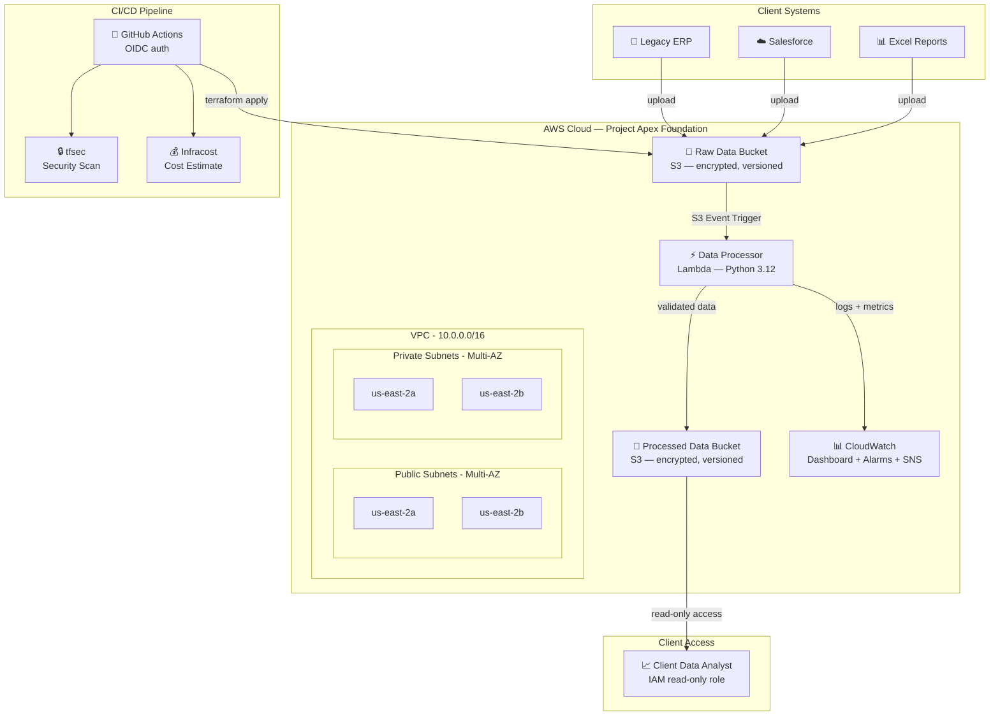

# 🏛️ Project Apex: Enterprise Cloud Data Foundation

**A high-assurance, multi-tenant AWS data foundation for Private Equity portfolio acquisitions — provisioned with Terraform and deployed via GitHub Actions CI/CD.**

---

## 📋 The Scenario

> A Private Equity firm just acquired a mid-market manufacturing company. The company's financial data is scattered across legacy systems — some in on-premises ERPs, some in spreadsheets, some in Salesforce. The PE firm needs this data centralized in the cloud so their analysts can build dashboards, run forecasts, and track KPIs.
>
> **Project Apex builds the institutional cloud foundation that makes that possible.**

---

## 🏛️ Architecture



---

## 🔧 Tech Stack

| Component | Technology | Purpose |
|---|---|---|
| **Infrastructure as Code** | Terraform | Provision all AWS resources reproducibly |
| **Cloud Provider** | AWS (us-east-2) | VPC, S3, Lambda, IAM, CloudWatch, SNS |
| **CI/CD** | GitHub Actions | Automated plan on PR, deploy on merge |
| **Security Scanning** | tfsec | Catch misconfigurations before deploy |
| **Cost Estimation** | Infracost | Show cost impact on every PR |
| **Compute** | Lambda (Python 3.12) | Event-driven data processing |
| **Storage** | S3 | Encrypted, versioned data storage |
| **Monitoring** | CloudWatch | Dashboard, alarms, and SNS alerts |
| **Authentication** | OIDC | No static AWS credentials in CI/CD |

---

## 📐 Design Decisions

<details>
<summary><strong>🔹 Why Terraform over CloudFormation?</strong></summary>

**Context:** The client portfolio spans AWS and Azure environments.

**Decision:** Terraform is cloud-agnostic — the same IaC skills and modular patterns work across both providers. CloudFormation is AWS-only.

**Trade-off:** Terraform state management requires additional setup (S3 backend + DynamoDB locking), but this is a one-time cost that pays off in multi-cloud flexibility.

📄 Full ADR: [001-terraform-over-cloudformation.md](docs/adr/001-terraform-over-cloudformation.md)
</details>

<details>
<summary><strong>🔹 Why Lambda over AWS Glue for data processing?</strong></summary>

**Context:** We need to validate and move files from a raw bucket to a processed bucket.

**Decision:** Lambda — near-zero cost, event-driven, fast startup. AWS Glue is designed for complex ETL at scale, but for file validation and transfer, it's overkill.

**When to upgrade:** If the pipeline grows to need schema inference, complex joins, or Spark-based transformations, migrate to Glue or Step Functions.

📄 Full ADR: [003-lambda-over-glue-for-processing.md](docs/adr/003-lambda-over-glue-for-processing.md)
</details>

<details>
<summary><strong>🔹 Why OIDC instead of static AWS credentials?</strong></summary>

**Context:** GitHub Actions needs AWS access to deploy infrastructure.

**Decision:** OIDC federation — GitHub Actions assumes an IAM role directly using a short-lived token. No static access keys stored anywhere.

**Why it matters for PE:** Static credentials can be leaked, rotated improperly, or forgotten. OIDC eliminates that entire class of risk — critical when handling financial data for portfolio companies.

📄 Full ADR: [004-github-actions-with-oidc.md](docs/adr/004-github-actions-with-oidc.md)
</details>

<details>
<summary><strong>🔹 Why a reusable S3 module instead of individual bucket configs?</strong></summary>

**Context:** Both the raw and processed buckets need the same security baseline (encryption, versioning, public access blocked).

**Decision:** One Terraform module, called twice with different variables. This is the DRY (Don't Repeat Yourself) principle — update the module once, and all buckets inherit the change.

**Scaling:** When onboarding additional portfolio companies, add another module call — not another 50 lines of duplicated HCL.

📄 Full ADR: [002-s3-for-raw-data-storage.md](docs/adr/002-s3-for-raw-data-storage.md)
</details>

<details>
<summary><strong>🔹 Why remote state with DynamoDB locking?</strong></summary>

**Context:** In a team environment, multiple engineers may run Terraform simultaneously.

**Decision:** Store state in S3 with DynamoDB locking. This prevents two engineers (or two CI runs) from modifying infrastructure at the same time, which could corrupt the state file.

**Cost:** ~$0.25/month for DynamoDB on-demand + S3 storage. Worth it to prevent state corruption.

📄 Full ADR: [005-remote-state-with-locking.md](docs/adr/005-remote-state-with-locking.md)
</details>

<details>
<summary><strong>🔹 Why Infracost in the CI pipeline?</strong></summary>

**Context:** PE portfolio companies are cost-conscious. Every dollar of cloud spend needs justification.

**Decision:** Infracost runs on every PR and posts the estimated monthly cost as a comment. Engineers see cost impact before merging — no surprise bills.

**Consulting value:** This builds trust with PE clients. They can see that infrastructure changes are being evaluated not just for correctness and security, but for cost efficiency.

📄 Full ADR: [006-infracost-for-client-visibility.md](docs/adr/006-infracost-for-client-visibility.md)
</details>

<details>
<summary><strong>🔹 Why create a VPC if Lambda doesn't need one?</strong></summary>

**Context:** Lambda in this project accesses only AWS-managed services (S3, CloudWatch) via public endpoints, so it doesn't technically require VPC access.

**Decision:** The VPC is provisioned to support future compute resources (ECS, RDS, Elasticsearch) that WOULD require private network isolation. It demonstrates multi-AZ networking architecture and subnet isolation strategy.

**Production note:** For Lambda functions that need to access private resources (databases, internal APIs), configure VPC access and add VPC endpoints for AWS services to avoid NAT Gateway costs.
</details>

---

## 🚀 Getting Started

### Prerequisites
- AWS CLI configured (`aws configure`)
- Terraform >= 1.5 (`terraform version`)
- Git (`git version`)

### 1. Bootstrap State Backend

Before initializing Terraform, create the S3 bucket and DynamoDB table for remote state:

```bash
# Create state bucket
aws s3api create-bucket \
  --bucket project-apex-tfstate \
  --region us-east-2 \
  --create-bucket-configuration LocationConstraint=us-east-2

# Enable versioning on state bucket
aws s3api put-bucket-versioning \
  --bucket project-apex-tfstate \
  --versioning-configuration Status=Enabled

# Enable encryption on state bucket
aws s3api put-bucket-encryption \
  --bucket project-apex-tfstate \
  --server-side-encryption-configuration \
  '{"Rules":[{"ApplyServerSideEncryptionByDefault":{"SSEAlgorithm":"AES256"}}]}'

# Create DynamoDB lock table
aws dynamodb create-table \
  --table-name project-apex-tflock \
  --attribute-definitions AttributeName=LockID,AttributeType=S \
  --key-schema AttributeName=LockID,KeyType=HASH \
  --billing-mode PAY_PER_REQUEST \
  --region us-east-2
```

### 2. Initialize & Deploy

```bash
cd terraform
terraform init
terraform plan
terraform apply
```

### 3. Test the Pipeline

```bash
# Create a test CSV file
echo "id,company,revenue,quarter" > /tmp/test-data.csv
echo "1,Acme Corp,1500000,Q3-2026" >> /tmp/test-data.csv

# Upload to raw data bucket (triggers Lambda)
aws s3 cp /tmp/test-data.csv \
  s3://$(terraform output -raw raw_data_bucket_name)/uploads/test-data.csv

# Verify Lambda processed it
aws s3 ls \
  s3://$(terraform output -raw processed_data_bucket_name)/processed/ \
  --recursive

# Check Lambda logs
aws logs tail \
  /aws/lambda/project-apex-dev-processor \
  --since 5m
```

---

## 📁 Repository Structure

```
project-apex/
├── README.md                          # This file — architecture overview
├── .github/workflows/
│   ├── plan.yml                       # PR: terraform plan + tfsec + infracost
│   └── deploy.yml                     # Merge: terraform apply
├── terraform/
│   ├── main.tf                        # Provider config, backend, data sources
│   ├── variables.tf                   # Input variables
│   ├── outputs.tf                     # Key outputs
│   ├── vpc.tf                         # VPC, subnets, routing
│   ├── s3.tf                          # Data buckets (using reusable module)
│   ├── iam.tf                         # IAM roles (Lambda, Client, GitHub OIDC)
│   ├── lambda.tf                      # Data processor function
│   ├── monitoring.tf                  # CloudWatch dashboard, alarms, SNS
│   └── modules/s3-bucket/             # Reusable S3 module
├── lambda/processor/
│   ├── handler.py                     # Python data processor
│   └── requirements.txt
└── docs/adr/                          # Architecture Decision Records
    ├── 001-terraform-over-cloudformation.md
    ├── 002-s3-for-raw-data-storage.md
    ├── 003-lambda-over-glue-for-processing.md
    ├── 004-github-actions-with-oidc.md
    ├── 005-remote-state-with-locking.md
    └── 006-infracost-for-client-visibility.md
```

---

## 🔗 Architecture Decision Records

| # | Decision | Summary |
|---|---|---|
| [001](docs/adr/001-terraform-over-cloudformation.md) | Terraform over CloudFormation | Cloud-agnostic IaC for multi-cloud PE portfolios |
| [002](docs/adr/002-s3-for-raw-data-storage.md) | S3 for raw data storage | Encrypted, versioned, lifecycle-managed |
| [003](docs/adr/003-lambda-over-glue-for-processing.md) | Lambda over Glue | Right-sized compute for file validation |
| [004](docs/adr/004-github-actions-with-oidc.md) | GitHub Actions with OIDC | No static credentials in CI/CD |
| [005](docs/adr/005-remote-state-with-locking.md) | Remote state with locking | Safe concurrent Terraform operations |
| [006](docs/adr/006-infracost-for-client-visibility.md) | Infracost for cost visibility | Transparent cloud spending for PE clients |

---

## 📊 Estimated Monthly Cost

| Resource | Estimated Cost |
|---|---|
| S3 (2 buckets) | ~$0.50 |
| Lambda | ~$0.00 (free tier) |
| CloudWatch | ~$3.00 |
| SNS | ~$0.00 |
| DynamoDB (state lock) | ~$0.25 |
| VPC | ~$0.00 (no NAT Gateway) |
| **Total** | **~$3.75/month** |

*Run `infracost breakdown --path=terraform` for a detailed estimate.*

---

## 📝 License

This project is a portfolio demonstration of cloud infrastructure architecture for Private Equity data centralization use cases.
