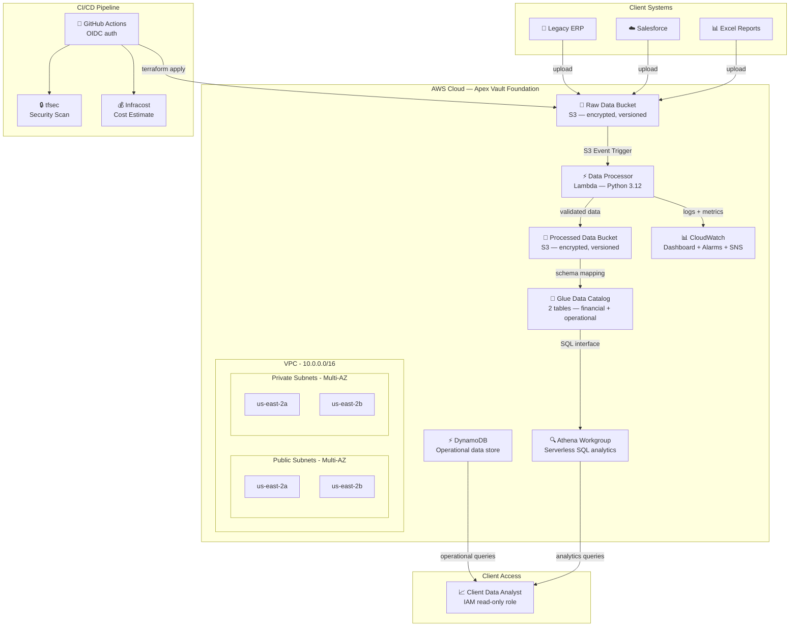

# 🏛️ Apex Vault — Enterprise Portfolio Data Platform

**A production-grade, multi-tenant AWS data platform for enterprise portfolio management — built with Terraform, deployed via GitHub Actions CI/CD, and designed for organizations managing multiple business units at scale.**

> **The Big Idea:** Apex Vault is the cloud data foundation that replaces fragmented spreadsheets, siloed databases, and manual reporting with a single, automated data pipeline. Upload financial data from any source — it's validated, encrypted, cataloged, and queryable in seconds. Every portfolio company gets its own isolated data environment, provisioned with two lines of Terraform.

🔗 **[Live Dashboard](https://maxx1.github.io/pe-data-landing-zone/)** · **[Architecture Decision Records](docs/adr/)**

---

## 📋 The Scenario

> A Private Equity firm just acquired a mid-market manufacturing company. The company's financial data is scattered across legacy systems — some in on-premises ERPs, some in spreadsheets, some in Salesforce. The PE firm needs this data centralized in the cloud so their analysts can build dashboards, run forecasts, and track KPIs.
>
> **Apex Vault builds the institutional cloud foundation that makes that possible.**

---

## 🏛️ Architecture



---

## ☁️ AWS Resources (Cloud)

Every AWS service used in this platform, what it does, and where it's defined:

| AWS Service | Resource | What It Does | Terraform File |
|---|---|---|---|
| **S3** | 10 buckets (raw + processed × 4 companies, + Athena results) | Encrypted, versioned data lake with automated lifecycle tiering (Standard → Standard-IA → Glacier → Delete) | [`s3.tf`](terraform/s3.tf) |
| **Lambda** | `data_processor` — Python 3.12, 256MB, 30s timeout | Event-driven file validation and transfer. Triggers on S3 upload, validates file type/size, copies to processed bucket with metadata tags | [`lambda.tf`](terraform/lambda.tf) |
| **DynamoDB** | `operational-data` table — PAY_PER_REQUEST billing | Real-time operational tracking for high-velocity data (shipment metrics, inventory). Sub-millisecond reads, $0 when idle, point-in-time recovery enabled | [`dynamodb.tf`](terraform/dynamodb.tf) |
| **Athena** | `analytics-workgroup` — SSE_S3 encrypted results | Serverless SQL queries over S3 data. Analysts run standard SQL without provisioning databases. Pay per query, not per hour | [`athena.tf`](terraform/athena.tf) |
| **Glue** | 2 catalog tables: `financial_records`, `operational_records` | Schema-on-read data catalog. Maps S3 CSV data to SQL-queryable tables with typed columns (revenue, EBITDA, shipment metrics) | [`athena.tf`](terraform/athena.tf) |
| **VPC** | Multi-AZ: 2 public subnets + 2 private subnets, IGW, route tables | Network isolation foundation. Public subnets for load balancers, private subnets for future compute (ECS, RDS). No NAT Gateway in dev ($0 cost) | [`vpc.tf`](terraform/vpc.tf) |
| **IAM** | 3 roles: Lambda execution, Client analyst (read-only), GitHub OIDC | Least-privilege access control. Lambda gets read-raw/write-processed only. Analysts get read-processed only. GitHub Actions uses OIDC federation (zero static credentials) | [`iam.tf`](terraform/iam.tf) |
| **CloudWatch** | Dashboard (6 widgets), 2 alarms (errors + throttles), log group (7-day retention) | Real-time pipeline monitoring. Tracks Lambda invocations, errors, duration, throttles, plus DynamoDB read/write units and latency | [`monitoring.tf`](terraform/monitoring.tf) |
| **SNS** | Alert topic with optional email subscription | Alarm notifications. Lambda error count > 3 or throttle count > 5 within 5 minutes triggers email alerts | [`monitoring.tf`](terraform/monitoring.tf) |

---

## 🔧 Terraform (Infrastructure as Code)

How every piece of infrastructure is defined, versioned, and deployed as code:

| Component | File(s) | How It Works |
|---|---|---|
| **Remote State Backend** | [`main.tf`](terraform/main.tf) | Terraform state stored in S3 with DynamoDB locking. Prevents concurrent modifications in team environments. Encrypted at rest |
| **Reusable S3 Module** | [`modules/s3-bucket/`](terraform/modules/s3-bucket/) | One module, called 10 times. Every bucket gets: AES-256 encryption, versioning, public access blocked, SSL-only policy, 3-tier lifecycle rules. Change the module once → all 10 buckets inherit it |
| **Multi-Tenant Onboarding** | [`s3.tf`](terraform/s3.tf) | Adding a new portfolio company = 2 module calls (~15 lines of HCL). Each company gets isolated raw + processed buckets with identical security baselines |
| **Variable-Driven Config** | [`variables.tf`](terraform/variables.tf) | All values parameterized: project name, environment (dev/staging/prod with validation), region, client name, VPC CIDR, alert email. Zero hardcoded strings |
| **Data Catalog** | [`athena.tf`](terraform/athena.tf) | Glue catalog tables auto-map S3 data to SQL-queryable schemas. Financial records (revenue, expenses, EBITDA) + operational records (shipments, cost per unit, on-time rate) |
| **Monitoring as Code** | [`monitoring.tf`](terraform/monitoring.tf) | CloudWatch dashboard with 6 metric widgets, error/throttle alarms, and SNS alerting — all defined declaratively. Pipeline health visible without AWS console access |
| **Default Tags** | [`main.tf`](terraform/main.tf) | Every resource auto-tagged: `Project`, `Environment`, `ManagedBy=terraform`, `Client`, `Service`. Consistent tagging strategy for FinOps cost allocation |

### Terraform Module Architecture

```
terraform/
├── main.tf                     # Provider config, S3 backend, default tags
├── variables.tf                # All input variables (parameterized)
├── outputs.tf                  # Key outputs (bucket names, ARNs, dashboard URL)
├── vpc.tf                      # VPC, 4 subnets (2 public + 2 private), IGW, route tables
├── s3.tf                       # 10 S3 buckets via reusable module (4 companies × 2 + Athena results)
├── iam.tf                      # 3 IAM roles + policies (Lambda, Analyst, GitHub OIDC)
├── lambda.tf                   # Data processor function + S3 invoke permission
├── athena.tf                   # Athena workgroup + Glue catalog (2 tables)
├── dynamodb.tf                 # Operational data store (PAY_PER_REQUEST)
├── monitoring.tf               # CloudWatch dashboard + alarms + SNS
└── modules/
    └── s3-bucket/
        ├── main.tf             # Bucket + encryption + versioning + public block + SSL policy + lifecycle
        ├── variables.tf        # Module inputs (name, purpose, lifecycle settings)
        └── outputs.tf          # Module outputs (bucket_id, bucket_arn)
```

---

## 🔄 GitHub Actions (CI/CD)

Automated infrastructure deployment with security scanning and cost estimation on every change:

| Workflow | File | Trigger | What It Does |
|---|---|---|---|
| **Terraform Plan** | [`plan.yml`](.github/workflows/plan.yml) | Pull Request → `main` | `terraform init` → `terraform validate` → `terraform plan` (posted as PR comment) → tfsec security scan → Infracost cost estimate (posted as PR comment) |
| **Terraform Deploy** | [`deploy.yml`](.github/workflows/deploy.yml) | Push to `main` | `terraform init` → `terraform plan` → `terraform apply -auto-approve` |

### CI/CD Security Model

```
GitHub Actions Runner
    │
    ├── OIDC Federation (no static credentials)
    │   └── Assumes IAM role via short-lived token
    │       └── Scoped to this repository only
    │
    ├── Pull Request Pipeline
    │   ├── terraform plan    → Preview what will change
    │   ├── tfsec             → Catch security misconfigurations
    │   └── Infracost         → Show cost impact before merge
    │
    └── Deploy Pipeline
        └── terraform apply   → Provision/update AWS resources
```

**Key design decisions:**
- **OIDC over static credentials:** GitHub authenticates to AWS with a temporary token. No AWS access keys stored in GitHub Secrets — ever. ([ADR-004](docs/adr/004-github-actions-with-oidc.md))
- **Plan on PR, Apply on merge:** Engineers and reviewers see the exact infrastructure diff and cost impact before any change hits production
- **tfsec integration:** Catches misconfigurations (unencrypted buckets, overly permissive IAM) before they reach AWS
- **Infracost integration:** Every PR shows the dollar-per-month impact — critical for cost-conscious PE portfolio environments ([ADR-006](docs/adr/006-infracost-for-client-visibility.md))

---

## 🔧 Tech Stack

| Component | Technology | Purpose |
|---|---|---|
| **Infrastructure as Code** | Terraform | Provision all AWS resources reproducibly |
| **Cloud Provider** | AWS (us-east-2) | VPC, S3, Lambda, IAM, CloudWatch, SNS, DynamoDB, Athena, Glue |
| **CI/CD** | GitHub Actions | Automated plan on PR, deploy on merge |
| **Security Scanning** | tfsec | Catch misconfigurations before deploy |
| **Cost Estimation** | Infracost | Show cost impact on every PR |
| **Compute** | Lambda (Python 3.12) | Event-driven data processing |
| **Storage** | S3 | Encrypted, versioned data storage |
| **NoSQL** | DynamoDB | Real-time operational data (sub-ms reads) |
| **Analytics** | Athena + Glue | Serverless SQL over the data lake |
| **Monitoring** | CloudWatch | Dashboard, alarms, and SNS alerts |
| **Authentication** | OIDC | No static AWS credentials in CI/CD |

---

## 📐 Design Decisions

<details>
<summary><strong>🔹 Why Terraform over CloudFormation?</strong></summary>

**Context:** The client portfolio spans AWS and Azure environments.

**Decision:** Terraform is cloud-agnostic — the same IaC skills and modular patterns work across both providers. CloudFormation is AWS-only.

**Trade-off:** Terraform state management requires additional setup (S3 backend + DynamoDB locking), but this is a one-time cost that pays off in multi-cloud flexibility.

📄 Full ADR: [001-terraform-over-cloudformation.md](docs/adr/001-terraform-over-cloudformation.md)
</details>

<details>
<summary><strong>🔹 Why Lambda over AWS Glue for data processing?</strong></summary>

**Context:** We need to validate and move files from a raw bucket to a processed bucket.

**Decision:** Lambda — near-zero cost, event-driven, fast startup. AWS Glue is designed for complex ETL at scale, but for file validation and transfer, it's overkill.

**When to upgrade:** If the pipeline grows to need schema inference, complex joins, or Spark-based transformations, migrate to Glue or Step Functions.

📄 Full ADR: [003-lambda-over-glue-for-processing.md](docs/adr/003-lambda-over-glue-for-processing.md)
</details>

<details>
<summary><strong>🔹 Why OIDC instead of static AWS credentials?</strong></summary>

**Context:** GitHub Actions needs AWS access to deploy infrastructure.

**Decision:** OIDC federation — GitHub Actions assumes an IAM role directly using a short-lived token. No static access keys stored anywhere.

**Why it matters for PE:** Static credentials can be leaked, rotated improperly, or forgotten. OIDC eliminates that entire class of risk — critical when handling financial data for portfolio companies.

📄 Full ADR: [004-github-actions-with-oidc.md](docs/adr/004-github-actions-with-oidc.md)
</details>

<details>
<summary><strong>🔹 Why a reusable S3 module instead of individual bucket configs?</strong></summary>

**Context:** Both the raw and processed buckets need the same security baseline (encryption, versioning, public access blocked).

**Decision:** One Terraform module, called twice with different variables. This is the DRY (Don't Repeat Yourself) principle — update the module once, and all buckets inherit the change.

**Scaling:** When onboarding additional portfolio companies, add another module call — not another 50 lines of duplicated HCL.

📄 Full ADR: [002-s3-for-raw-data-storage.md](docs/adr/002-s3-for-raw-data-storage.md)
</details>

<details>
<summary><strong>🔹 Why remote state with DynamoDB locking?</strong></summary>

**Context:** In a team environment, multiple engineers may run Terraform simultaneously.

**Decision:** Store state in S3 with DynamoDB locking. This prevents two engineers (or two CI runs) from modifying infrastructure at the same time, which could corrupt the state file.

**Cost:** ~$0.25/month for DynamoDB on-demand + S3 storage. Worth it to prevent state corruption.

📄 Full ADR: [005-remote-state-with-locking.md](docs/adr/005-remote-state-with-locking.md)
</details>

<details>
<summary><strong>🔹 Why Infracost in the CI pipeline?</strong></summary>

**Context:** PE portfolio companies are cost-conscious. Every dollar of cloud spend needs justification.

**Decision:** Infracost runs on every PR and posts the estimated monthly cost as a comment. Engineers see cost impact before merging — no surprise bills.

**Consulting value:** This builds trust with PE clients. They can see that infrastructure changes are being evaluated not just for correctness and security, but for cost efficiency.

📄 Full ADR: [006-infracost-for-client-visibility.md](docs/adr/006-infracost-for-client-visibility.md)
</details>

<details>
<summary><strong>🔹 Why create a VPC if Lambda doesn't need one?</strong></summary>

**Context:** Lambda in this project accesses only AWS-managed services (S3, CloudWatch) via public endpoints, so it doesn't technically require VPC access.

**Decision:** The VPC is provisioned to support future compute resources (ECS, RDS, Elasticsearch) that WOULD require private network isolation. It demonstrates multi-AZ networking architecture and subnet isolation strategy.

**Production note:** For Lambda functions that need to access private resources (databases, internal APIs), configure VPC access and add VPC endpoints for AWS services to avoid NAT Gateway costs.
</details>

<details>
<summary><strong>🔹 Why DynamoDB for operational data?</strong></summary>

**Context:** Supply chain and logistics companies generate high-velocity operational data (shipment tracking, delivery metrics) that changes frequently.

**Decision:** DynamoDB for operational data, S3/Athena for batch financial data. DynamoDB provides consistent single-digit millisecond reads with PAY_PER_REQUEST billing ($0 when idle). Financial batch data that changes quarterly goes through the S3 → Lambda → Athena pipeline.

**Cost:** $0 at rest. Scales automatically under load without capacity planning.
</details>

---

## 🚀 Getting Started

### Prerequisites
- AWS CLI configured (`aws configure`)
- Terraform >= 1.5 (`terraform version`)
- Git (`git version`)

### 1. Bootstrap State Backend

Before initializing Terraform, create the S3 bucket and DynamoDB table for remote state:

```bash
# Create state bucket
aws s3api create-bucket \
  --bucket project-apex-tfstate \
  --region us-east-2 \
  --create-bucket-configuration LocationConstraint=us-east-2

# Enable versioning on state bucket
aws s3api put-bucket-versioning \
  --bucket project-apex-tfstate \
  --versioning-configuration Status=Enabled

# Enable encryption on state bucket
aws s3api put-bucket-encryption \
  --bucket project-apex-tfstate \
  --server-side-encryption-configuration \
  '{"Rules":[{"ApplyServerSideEncryptionByDefault":{"SSEAlgorithm":"AES256"}}]}'

# Create DynamoDB lock table
aws dynamodb create-table \
  --table-name project-apex-tflock \
  --attribute-definitions AttributeName=LockID,AttributeType=S \
  --key-schema AttributeName=LockID,KeyType=HASH \
  --billing-mode PAY_PER_REQUEST \
  --region us-east-2
```

### 2. Initialize & Deploy

```bash
cd terraform
terraform init
terraform plan
terraform apply
```

### 3. Test the Pipeline

```bash
# Create a test CSV file
echo "id,company,revenue,quarter" > /tmp/test-data.csv
echo "1,Acme Corp,1500000,Q3-2026" >> /tmp/test-data.csv

# Upload to raw data bucket (triggers Lambda)
aws s3 cp /tmp/test-data.csv \
  s3://$(terraform output -raw raw_data_bucket_name)/uploads/test-data.csv

# Verify Lambda processed it
aws s3 ls \
  s3://$(terraform output -raw processed_data_bucket_name)/processed/ \
  --recursive

# Check Lambda logs
aws logs tail \
  /aws/lambda/project-apex-dev-processor \
  --since 5m
```

---

## 📁 Repository Structure

```
apex-vault/
├── README.md                              # Architecture overview + resource documentation
├── .github/workflows/
│   ├── plan.yml                           # PR: terraform plan + tfsec + infracost
│   └── deploy.yml                         # Merge: terraform apply
├── terraform/
│   ├── main.tf                            # Provider config, S3 backend, default tags
│   ├── variables.tf                       # Input variables (all parameterized)
│   ├── outputs.tf                         # Key outputs (bucket names, ARNs, URLs)
│   ├── vpc.tf                             # VPC, subnets, routing (multi-AZ)
│   ├── s3.tf                              # Data buckets × 4 companies (reusable module)
│   ├── iam.tf                             # IAM roles (Lambda, Client Analyst, GitHub OIDC)
│   ├── lambda.tf                          # Data processor function
│   ├── athena.tf                          # Glue catalog + Athena workgroup
│   ├── dynamodb.tf                        # Operational data store (Summit Ridge)
│   ├── monitoring.tf                      # CloudWatch dashboard + alarms + SNS
│   └── modules/s3-bucket/                 # Reusable S3 module (encryption, lifecycle, SSL)
│       ├── main.tf                        # Bucket + 5 security/lifecycle resources
│       ├── variables.tf                   # Module inputs
│       └── outputs.tf                     # Module outputs (bucket_id, bucket_arn)
├── lambda/processor/
│   ├── handler.py                         # Python data processor (validates → transfers)
│   └── requirements.txt
├── docs/
│   ├── index.html                         # Live dashboard (GitHub Pages)
│   ├── images/                            # Production AWS screenshots
│   │   ├── athena-query-results.png
│   │   ├── cloudwatch-duration-graph.png
│   │   ├── s3-console-buckets.png
│   │   └── terraform-module-reuse.png
│   └── adr/                               # Architecture Decision Records
│       ├── 001-terraform-over-cloudformation.md
│       ├── 002-s3-for-raw-data-storage.md
│       ├── 003-lambda-over-glue-for-processing.md
│       ├── 004-github-actions-with-oidc.md
│       ├── 005-remote-state-with-locking.md
│       └── 006-infracost-for-client-visibility.md
```

---

## 🏢 Portfolio Companies (Multi-Tenant Demo)

| Company | Industry | Infrastructure | Terraform Resources |
|---|---|---|---|
| **Prestige Industrial Services** | Mid-market industrial | S3 data lake + Lambda processing + Athena analytics | `raw_data_bucket`, `processed_data_bucket`, `data_processor`, `financial_records` |
| **Clearwater Health Partners** | Healthcare staffing | Multi-tenant onboarding via reusable S3 modules | `clearwater_raw_data_bucket`, `clearwater_processed_data_bucket` |
| **Summit Ridge Logistics** | Supply chain / 3PL | DynamoDB for real-time operational tracking + S3 for batch financials | `summit_ridge_raw_data_bucket`, `summit_ridge_processed_data_bucket`, `operational_data` (DynamoDB), `operational_records` (Glue) |
| **Meridian Capital Advisors** | Financial advisory | Snowflake-ready staging layer + PostgreSQL-compatible schemas | `meridian_raw_data_bucket`, `meridian_processed_data_bucket` |

---

## 🔗 Architecture Decision Records

| # | Decision | Summary |
|---|---|---|
| [001](docs/adr/001-terraform-over-cloudformation.md) | Terraform over CloudFormation | Cloud-agnostic IaC for multi-cloud PE portfolios |
| [002](docs/adr/002-s3-for-raw-data-storage.md) | S3 for raw data storage | Encrypted, versioned, lifecycle-managed |
| [003](docs/adr/003-lambda-over-glue-for-processing.md) | Lambda over Glue | Right-sized compute for file validation |
| [004](docs/adr/004-github-actions-with-oidc.md) | GitHub Actions with OIDC | No static credentials in CI/CD |
| [005](docs/adr/005-remote-state-with-locking.md) | Remote state with locking | Safe concurrent Terraform operations |
| [006](docs/adr/006-infracost-for-client-visibility.md) | Infracost for cost visibility | Transparent cloud spending for PE clients |

---

## 📊 Estimated Monthly Cost

| Resource | Estimated Cost |
|---|---|
| S3 (10 buckets) | ~$1.50 |
| Lambda | ~$0.00 (free tier) |
| DynamoDB | ~$0.00 (pay-per-request, $0 idle) |
| Athena | ~$0.00 (charged per query scan) |
| Glue Catalog | ~$0.00 (free tier) |
| CloudWatch | ~$3.00 |
| SNS | ~$0.00 |
| DynamoDB (state lock) | ~$0.25 |
| VPC | ~$0.00 (no NAT Gateway) |
| **Total** | **~$4.75/month** |

*Run `infracost breakdown --path=terraform` for a detailed estimate.*

---

## 📝 License

This project is a portfolio demonstration of production-grade cloud data infrastructure for enterprise portfolio management.

Built by **Jeremi D Wright**.
